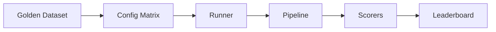

# GenAI Eval Harness

[](https://github.com/CaioHAndradeLima/genai-eval-harness/actions/workflows/ci.yml)

**You changed the RAG prompt. Did the bot get better or worse?** Most teams guess — or manually try five questions in a chat UI. This project is a small, end-to-end **evaluation harness**: you define several setups (model, prompt, retriever, data), run them all on the **same labeled questions**, and get a **scorecard** you can compare and gate in CI.

Same idea as offline eval in production (Promptfoo, Ragas, MLflow GenAI eval), implemented clearly in Python so you can read and extend it.

---

## Real scenario: documentation Q&A bot

Imagine you ship a **RAG assistant** over internal docs (here: public [MLflow](https://mlflow.org) documentation as a stand-in).

**Monday:** A teammate switches retrieval from keyword search (BM25) to hybrid search + reranking and rewrites the system prompt.

**Without an eval harness:**

- Everyone tests different questions in the UI.
- Nobody knows if retrieval improved or the new prompt hallucinates more.
- The PR merges; users report wrong answers two weeks later.

**With this harness:**

1. You keep a **golden dataset** — e.g. 5 questions with expected answers and “which doc chunk should be retrieved” labels.
2. You define two **variants** in YAML: `bm25-only` vs `hybrid-rerank` (same model, same docs, different retrieval + prompt).
3. You run one command; both variants answer all 5 questions.
4. **Scorers** report separately:
   - **Retrieval:** did we fetch the right chunk? (`recall@k`, MRR)
   - **Generation:** is the answer grounded in context? (`faithfulness`, `exact_match`)
   - **Ops:** latency and token usage
5. A **leaderboard** ranks setups; **GitHub Actions** fails the PR if metrics drop vs a saved baseline.

You are not replacing human review — you are making comparisons **reproducible and automatable**.

---

## What one eval sample looks like

Golden data lives in JSON (`datasets/rag/mlflow_qa.json`). Each row is one test case:

```json
{
  "id": "mlflow-003",
  "input": "What does mlflow.evaluate do?",
  "expected_output": "mlflow.evaluate runs evaluation on a model or pipeline and computes configured metrics.",
  "reference_contexts": [
    "The mlflow.evaluate API evaluates models and LLM applications, computing built-in and custom metrics."
  ]
}
```

- `input` — user question fed to the pipeline  
- `expected_output` — reference answer for generation metrics  
- `reference_contexts` — what retrieval should find (for recall@k / MRR)

The **corpus** the retriever searches is separate: `data/corpus/mlflow_docs.txt` (chunked at runtime).

---

## Walkthrough: the bundled example

The repo includes a ready-made matrix: [`configs/matrices/rag_qa_baseline.yaml`](configs/matrices/rag_qa_baseline.yaml)

| Variant | Retriever | Prompt | What you're testing |
|---------|-----------|--------|---------------------|
| `bm25-only` | BM25, top-5 | `qa_v1.jinja` | Simple lexical retrieval |
| `hybrid-rerank` | Hybrid + rerank, top-10 | `qa_v2.jinja` | Richer retrieval + stricter prompt |

Both use the same 5-sample golden set and the same model config (`gpt-4o-mini` when you use `--live`).

**Flow for one sample:**

```
Question: "What is MLflow Tracking?"
    → Retriever pulls top-k chunks from mlflow_docs.txt
    → Jinja prompt fills in question + chunks
    → LLM generates an answer
    → Scorers compare retrieval vs reference_contexts and answer vs expected_output
```

**After a full run** (`eval-harness run ... --mock`), you get something like:

| Variant | recall@k | mrr | faithfulness | Notes |
|---------|----------|-----|--------------|--------|
| bm25-only | 1.00 | 1.00 | ~0.47 | Baseline setup |
| hybrid-rerank | 1.00 | 1.00 | ~0.47 | Same retrieval quality on this tiny set; differs on harder corpora |

With `--mock`, the LLM returns deterministic stub text (no API key, fast CI). With `--live`, you need `OPENAI_API_KEY` and scores reflect real generation.

Artifacts on disk:

```
results/runs/rag-qa-baseline_<timestamp>/
├── matrix_run.json      # full run
├── bm25-only.json       # per-variant sample outputs + metrics
├── hybrid-rerank.json
├── leaderboard.csv
└── leaderboard.html     # open in a browser
```

---

## Who this is for

| You are… | Why clone this |
|----------|----------------|
| **Learning AI engineering** | See eval split into pipeline / runner / scorers / CI — not one monolithic script |
| **Interview prep** | Explain offline eval, golden sets, layered RAG metrics, regression gates |
| **Starting a team harness** | Fork patterns: YAML matrix, Pydantic configs, mock provider for tests |
| **Comparing tools** | Understand what Promptfoo/Ragas/MLflow eval *do* under the hood |

---

## Quick start

```bash
git clone https://github.com/CaioHAndradeLima/genai-eval-harness.git
cd genai-eval-harness
python -m venv .venv && source .venv/bin/activate
pip install -e ".[dev]"

# 1) Check configs and dataset paths
eval-harness validate configs/matrices/rag_qa_baseline.yaml

# 2) Debug a single question end-to-end
eval-harness run-sample configs/matrices/rag_qa_baseline.yaml \
  --variant bm25-only --sample-id mlflow-001 --mock

# 3) Run the full comparison (2 variants × 5 samples) + scores + leaderboard
eval-harness run configs/matrices/rag_qa_baseline.yaml --mock

# 4) Same as CI: fail if metrics regress vs committed baseline
eval-harness run configs/matrices/rag_qa_baseline.yaml --mock \
  --baseline examples/baseline_metrics.json

pytest -q
```

**Live OpenAI run** (optional):

```bash
export OPENAI_API_KEY=sk-...
eval-harness run configs/matrices/rag_qa_baseline.yaml --live
```

More detail: [examples/README.md](examples/README.md).

---

## How CI uses it

On every push to `main`, GitHub Actions (see [`.github/workflows/ci.yml`](.github/workflows/ci.yml)):

1. Runs unit tests  
2. Validates the example matrix  
3. Executes the full mock eval and checks metrics against [`examples/baseline_metrics.json`](examples/baseline_metrics.json)

If someone breaks retrieval or scoring logic, the check fails before merge — similar to a unit test, but for **RAG behavior** on a fixed dataset.

---

## Architecture (high level)



| Layer | Role |
|-------|------|
| **Config matrix** | YAML list of variants to compare |
| **Pipeline** | Retrieve → prompt → generate (one sample) |
| **Runner** | All variants × all samples |
| **Scorers** | Retrieval vs generation vs ops metrics |
| **Leaderboard + baseline** | Rank variants; CI regression |

Deep dive: [docs/ARCHITECTURE.md](docs/ARCHITECTURE.md).

---

## Project layout

```
genai-eval-harness/
├── configs/matrices/     # Experiment definitions (what to compare)
├── datasets/             # Golden eval sets (labeled Q&A)
├── prompts/              # Versioned Jinja templates
├── data/corpus/          # Documents for RAG retrieval
├── examples/             # CI baseline metrics + docs
├── src/eval_harness/     # pipeline, runner, scorers, CLI
└── tests/                # Unit + regression tests
```

---

## Extending to your own use case

1. **Corpus** — replace `data/corpus/` with your docs (PDF/HTML → text pipeline is up to you).  
2. **Golden set** — add 30–100 real user or support questions with reference answers and gold chunks.  
3. **Matrix** — add variants: chunk size, top-k, models, prompts.  
4. **Baseline** — run once on `main`, commit floors to `examples/baseline_metrics.json`.  
5. **CI** — keep mock runs for speed; optional nightly `--live` job with secrets.

---

## Tech stack

Python 3.11+, Pydantic v2, Typer/Rich CLI, YAML/JSON configs, pytest, GitHub Actions.

---

## License

MIT — see [LICENSE](LICENSE).
