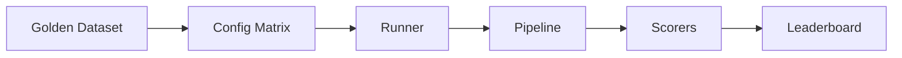

# GenAI Eval Harness

A reproducible **LLM evaluation pipeline** that sweeps model / prompt / retrieval / data configurations against a golden dataset and produces a scored leaderboard for each setup.

This is the engineering pattern behind offline eval, RAG benchmarking, and CI regression gates in production GenAI teams.

## Why this exists

| Problem | How the harness helps |
|---------|----------------------|
| "Which prompt is better?" | Run both against the same golden set, compare scores |
| "Did retrieval get worse?" | Track recall@k independently from generation quality |
| "Can we ship this change?" | Regression gate blocks merge if metrics drop |
| "What did we try last month?" | Every run logs config + git commit + dataset version |

## Architecture



See [docs/ARCHITECTURE.md](docs/ARCHITECTURE.md) for the full design and phase roadmap.

## Quick start

```bash
git clone https://github.com/CaioHAndradeLima/genai-eval-harness.git
cd genai-eval-harness
python -m venv .venv && source .venv/bin/activate
pip install -e ".[dev]"

# Validate the example experiment matrix
eval-harness validate configs/matrices/rag_qa_baseline.yaml

# Run one sample through the RAG pipeline (mock model, no API key)
eval-harness run-sample configs/matrices/rag_qa_baseline.yaml \
  --variant bm25-only --sample-id mlflow-001 --mock

# Show implementation roadmap
eval-harness info
```

## Project structure

```
genai-eval-harness/
├── configs/matrices/     # Experiment sweep definitions (YAML)
├── datasets/             # Golden eval sets (JSON)
├── prompts/              # Versioned prompt templates (Jinja)
├── data/corpus/          # Source documents for RAG retrieval
├── src/eval_harness/     # Python package
├── docs/                 # Architecture + phase docs
└── tests/                # Unit tests
```

## Example experiment matrix

Two variants compared on the same 5-sample MLflow Q&A golden set:

| Variant | Model | Retriever | Prompt |
|---------|-------|-----------|--------|
| `bm25-only` | gpt-4o-mini | BM25, top-5 | qa_v1 |
| `hybrid-rerank` | gpt-4o-mini | Hybrid + rerank, top-10 | qa_v2 |

Config: [`configs/matrices/rag_qa_baseline.yaml`](configs/matrices/rag_qa_baseline.yaml)

## Implementation phases

Each phase lands as a focused PR with architecture diagrams and a clear scope.

| Phase | Status | Scope |
|-------|--------|-------|
| 1 | ✅ | Foundation — models, config, CLI |
| 2 | ✅ | Pipeline — model, prompt, retriever, `run-sample` |
| 3 | 🔜 | Experiment runner |
| 4 | 🔜 | Scorers |
| 5 | 🔜 | Results store + leaderboard |
| 6 | 🔜 | Full RAG walkthrough |
| 7 | 🔜 | CI regression tests |

## Tech stack

- **Python 3.11+** with Pydantic v2 for config validation
- **Typer + Rich** for CLI
- **YAML/JSON** for config-as-code
- **pytest** for tests (Phase 7 adds CI)

## License

MIT — see [LICENSE](LICENSE).
