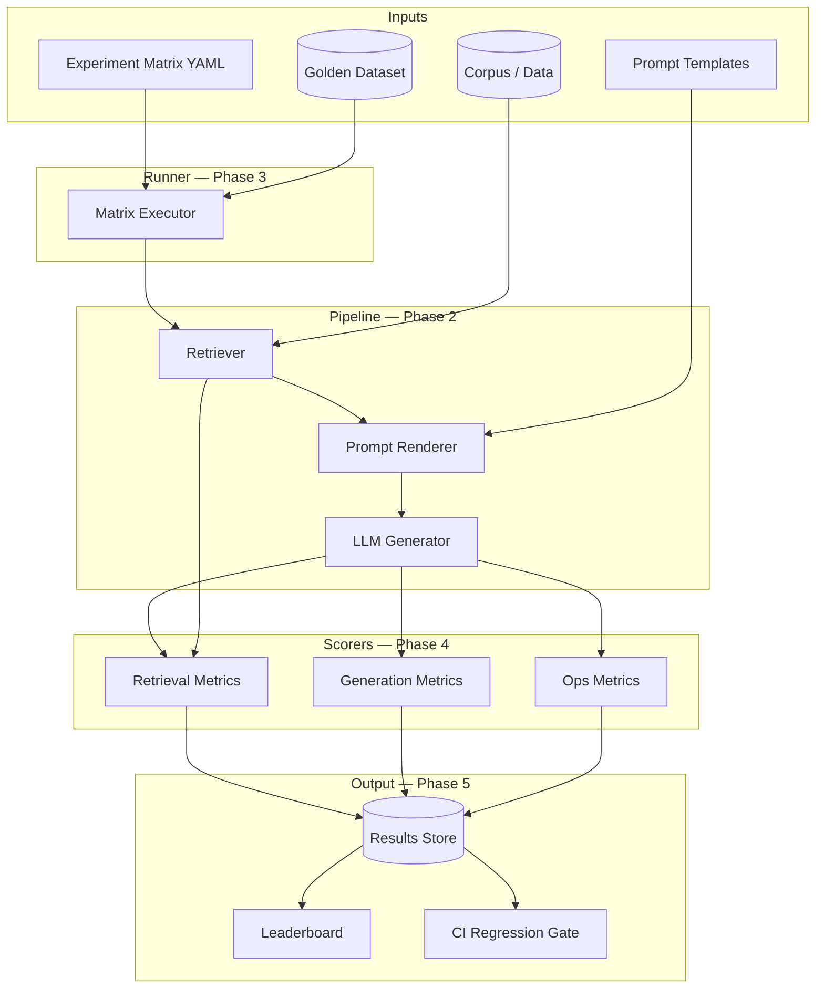

# Architecture

GenAI Eval Harness is an **offline evaluation pipeline** for LLM applications. It systematically runs a **config matrix** (model × prompt × retriever × data) against a **golden dataset**, scores each setup, and produces a **leaderboard**.

## End-to-end flow



## ASCII overview

```
 Golden Dataset          Experiment Matrix
       |                         |
       v                         v
   +-----------------------------------+
   |         Matrix Runner             |
   |  (for each variant in matrix)     |
   +-----------------------------------+
       |         |            |
       v         v            v
  Retriever   Prompt       Model
       \         |          /
        \        v         /
         +--> Generator <--+
                    |
                    v
              +-----------+
              |  Scorers  |
              +-----------+
                    |
                    v
           Results + Leaderboard
```

## Design principles

1. **Config-as-code** — Every experiment variant is a YAML file you can diff, review, and replay.
2. **Separation of concerns** — Pipeline produces outputs; scorers measure them; runner orchestrates.
3. **Reproducibility** — Git commit, dataset version, and config hash are logged with every run.
4. **Layered metrics** — Retrieval, generation, and ops (latency/cost) are scored independently.
5. **CI-ready** — Regression gates block merges when metrics drop below thresholds (Phase 7).

## Phase roadmap

| Phase | PR | Delivers |
|-------|-----|----------|
| 1 | #1 | Domain models, config schema, CLI `validate`, docs |
| 2 | #2 | `RAGPipeline`, `ModelProvider`, `PromptRenderer`, `Retriever` + `run-sample` CLI |
| 3 | #3 | `ExperimentRunner`, `eval-harness run`, JSON results under `results/runs/` |
| 4 | #4 | Scorers: recall@k, MRR, exact match, LLM-as-judge |
| 5 | #5 | JSON results store, CSV/HTML leaderboard |
| 6 | #6 | End-to-end RAG example with committed sample results |
| 7 | #7 | pytest regression suite + GitHub Actions |

## Config matrix example

One row in the matrix is a fully-specified **experiment variant**:

```
variant = model + prompt + retriever + data + scorers
```

The runner executes every variant against the same golden dataset so scores are comparable.

## Metric layers

```mermaid
flowchart LR
    subgraph retrieval [Retrieval Layer]
        R1[recall@k]
        R2[MRR]
        R3[nDCG]
    end

    subgraph generation [Generation Layer]
        G1[exact_match]
        G2[faithfulness]
        G3[answer_relevance]
    end

    subgraph ops [Ops Layer]
        O1[latency_ms]
        O2[token_count]
        O3[cost_usd]
    end

    retrieval --> AGG[Aggregate Scorecard]
    generation --> AGG
    ops --> AGG
```

Retrieval metrics diagnose "wrong document retrieved." Generation metrics diagnose "wrong answer given good context." Ops metrics trade quality against cost and latency.
