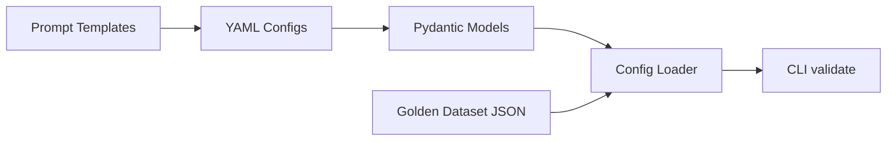

# Phase 1 — Foundation

## Goal

Establish the project skeleton, domain models, and config schema so every later phase plugs into a stable contract.

## What ships in this PR



## Why this order

Real eval harnesses fail when teams jump straight to calling APIs. The config schema and data models are the **contract** between:

- the **runner** (orchestration)
- the **pipeline** (inference)
- the **scorers** (measurement)
- the **store** (persistence)

Building the contract first means Phase 2–7 can develop in parallel without breaking each other.

## Files added

| Path | Purpose |
|------|---------|
| `src/eval_harness/models.py` | Domain types: samples, variants, results, leaderboard |
| `src/eval_harness/config.py` | YAML/JSON loader with validation |
| `src/eval_harness/cli.py` | `validate` and `info` commands |
| `configs/matrices/` | Example experiment matrix |
| `datasets/rag/` | Golden eval set (5 samples) |
| `prompts/rag/` | Versioned Jinja templates |
| `docs/ARCHITECTURE.md` | System design + roadmap |

## Validation command

```bash
pip install -e ".[dev]"
eval-harness validate configs/matrices/rag_qa_baseline.yaml
```

Expected: table of 2 variants with dataset sizes, green checkmark.

## Next phase preview

Phase 2 implements the **pipeline layer** — abstract interfaces for model calls, prompt rendering, and retrieval so the runner can swap implementations without changing orchestration code.
