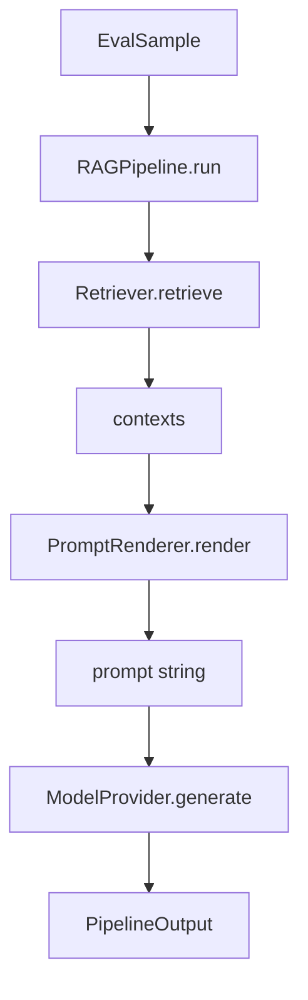

# Phase 2 — Pipeline Layer

## Goal

Implement swappable **model**, **prompt**, and **retriever** components wired into a single `RAGPipeline.run()` call. The runner (Phase 3) will call this without knowing implementation details.

## What ships in this PR



## Component map

```
ExperimentVariant (YAML)
        |
        v
   +-----------+
   |  Factory  |
   +-----------+
    /    |     \
   v     v      v
Retriever Prompt Model
   \     |      /
    \    v     /
     RAGPipeline
```

## Implementations

| Component | Implementations | Notes |
|-----------|-----------------|-------|
| `ModelProvider` | `MockModelProvider`, `OpenAIModelProvider` | Mock default — no API key for tests |
| `PromptRenderer` | Jinja2 templates | Strict undefined vars catch typos |
| `Retriever` | `Null`, `BM25`, `Hybrid` | Hybrid = BM25 + keyword overlap proxy |
| `RAGPipeline` | orchestrator | retrieve → render → generate |

## Why interfaces first

Production eval harnesses swap components constantly:

- Same retriever, different prompts → prompt A/B
- Same prompt, different models → model comparison
- Same model, different chunk sizes → retrieval tuning

The factory builds concrete instances from YAML so the runner only needs `build_rag_pipeline(variant)`.

## CLI smoke test

```bash
eval-harness run-sample configs/matrices/rag_qa_baseline.yaml \
  --variant bm25-only \
  --sample-id mlflow-001 \
  --mock
```

Use `--live` to call OpenAI (requires `OPENAI_API_KEY`).

## Next phase preview

Phase 3 adds the **ExperimentRunner** — loops over all variants in a matrix and all samples in a dataset, collecting `PipelineOutput` for scoring.
