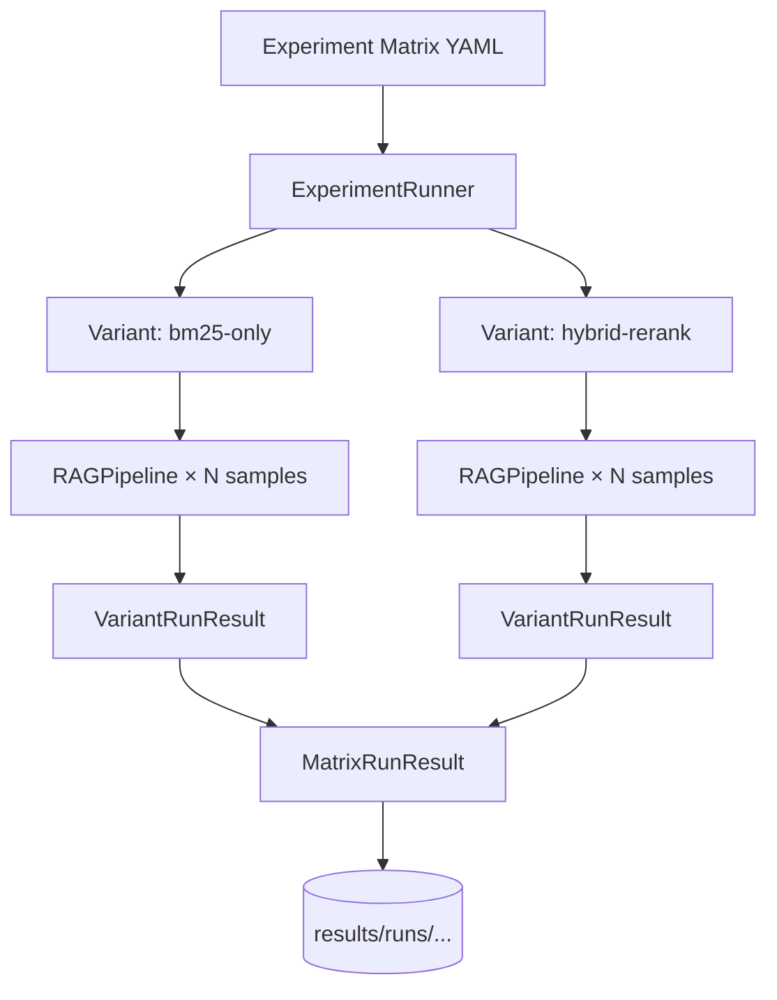

# Phase 3 — Experiment Runner

## Goal

Execute a full **config matrix** — every variant against every sample in its golden dataset — and persist raw outputs for scoring (Phase 4).

## What ships in this PR



## Runner loop

```
for variant in matrix.variants:
    dataset = load(variant.data.path)
    pipeline = build_rag_pipeline(variant)
    for sample in dataset.samples:
        output = pipeline.run(sample)
        sample_results.append(output)
    variant_results.append(VariantRunResult(...))
```

## Why separate runner from pipeline

| Layer | Responsibility |
|-------|----------------|
| Pipeline | One sample → one output |
| Runner | Many variants × many samples → structured run |
| Scorers (Phase 4) | Many outputs → metric scores |
| Store (Phase 5) | Runs → leaderboard |

The runner never computes metrics — it only orchestrates and records reproducibility metadata (git commit, timestamps).

## CLI

```bash
# Full matrix, mock model (no API key)
eval-harness run configs/matrices/rag_qa_baseline.yaml --mock

# Single variant
eval-harness run configs/matrices/rag_qa_baseline.yaml -v bm25-only --mock

# Live OpenAI
export OPENAI_API_KEY=sk-...
eval-harness run configs/matrices/rag_qa_baseline.yaml --live
```

## Output layout

```
results/runs/rag-qa-baseline_20260922T161100Z/
├── manifest.json       # summary metadata
├── matrix_run.json     # full MatrixRunResult
├── bm25-only.json      # per-variant results
└── hybrid-rerank.json
```

## Next phase preview

Phase 4 adds **Scorers** — plug into the runner output to compute recall@k, MRR, exact match, and LLM-as-judge faithfulness.
