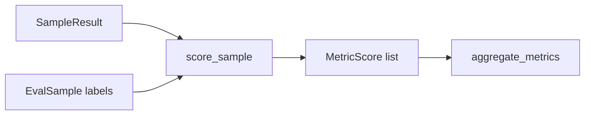

# Phases 4–7 — Scoring, leaderboard, baseline, CI

## Phase 4 — Scorers



- **Retrieval:** recall@k, MRR, nDCG (reference context overlap)
- **Generation:** exact_match, faithfulness, answer_relevance (heuristic; CI-safe without LLM judge)
- **Ops:** latency_ms, token_count (+ latency_p50_ms aggregate)

## Phase 5 — Leaderboard

After scoring, `build_leaderboard()` ranks variants; each run writes `leaderboard.csv` and `leaderboard.html`.

## Phase 6 — Baseline

`examples/baseline_metrics.json` stores minimum acceptable aggregate metrics. Used by `--baseline` and CI.

## Phase 7 — GitHub Actions

```yaml
pytest → validate → eval-harness run --mock --baseline examples/baseline_metrics.json
```

Fails the PR if retrieval/generation metrics regress beyond tolerance.
